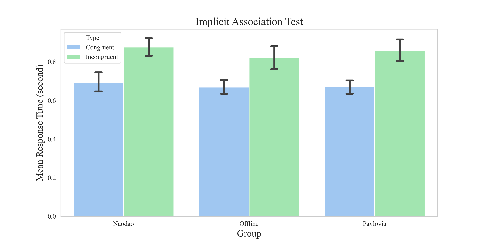
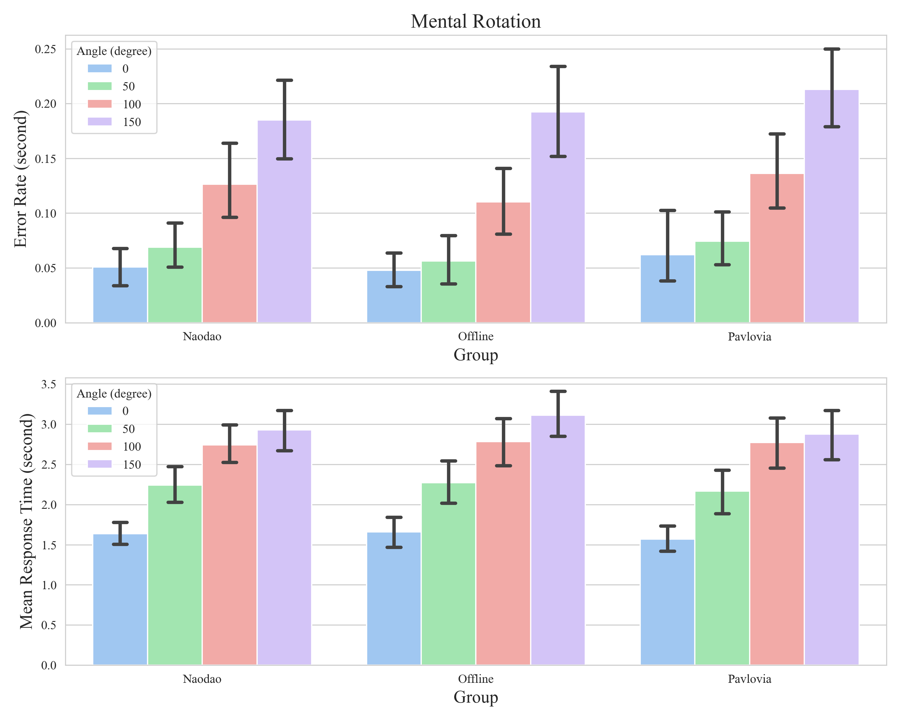
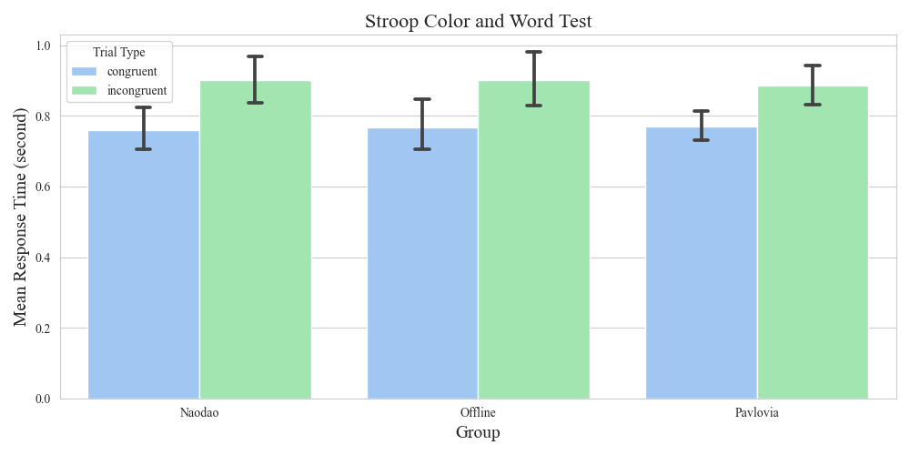

**Note**:

- Should you wish to access the corresponding plot data, kindly refer to the "Data" folder. All imagery utilized herein is stored in the "Pictures" folder for your reference. The detailed experimentd illustration and data analysis are in corresponding jupyter notebookd and experiment programs are in "experiment" folder. For instance, the IAT plot data can be located in Data/IAT.csv. Due to some issue, we're not able provide participant information like age.
- The preparation of these notes was undertaken with urgency. Should there be any discrepancies or alternate viewpoints, we are open to constructive criticism and corrections. Please do not hesitate to contact me at: [chen.guoqiu@connect.umac.mo](chen.guoqiu@connect.umac.mo).
- While we leveraged ChatGPT to craft portions of the textual content, including experimental descriptions, we underscore that pivotal components such as the programming code, detailed experimental delineations, and data analysis underwent meticulous manual development and review, thus assuring paramount precision and reliability.

# 1. Background

- **Objective:** Ensuring robust **data quality** is of utmost importance in the realm of online psychological experimental platforms. This concept of quality is expansive, encapsulating the validity of the incorporated tools, the caliber of the participant pool, and the precision embedded in the programmatic codes of the experimental setups. In this endeavor, we undertake a comprehensive validation of the **holistic** data reliability on the Naodao online research
  platform.
- **Design:**

  - **Experimental Paradigms:** We strategically selected three universally acclaimed foundational cognitive experimental paradigms: the **Implicit Association Test, the Mental Rotation Task, and the Stroop Color and Word Task**. A mixed design was employed, whereby each participant was assigned to complete all three tasks on a single platform.
  - **Analytical Metrics:** Integral to these paradigms is the employment of **reaction time** metrics, a procedure demanding both exacting data recording and temporal precision from the involved instrumentation. Moreover, we augmented the analytical robustness by incorporating an **error rate** metric in the analysis of the Mental Rotation task.
  - **Participant Recruitment:** We recruited a cohort of **40 participants for each platform**: the **Naodao** online platform utilized its **established participant pool**; both **Pavlovia and the offline** methods leveraged campus advertisements at **Beijing Normal University** for recruitment. The **Pavlovia and Naodao** platforms
    necessitated that participants use their **personal computers** to fulfill the study requirements, while **offline** participants availed themselves of the **laboratory facilities** at the Haidian campus of Beijing Normal University to complete the requisite tasks.
- **Results:**

  - Across all platforms and tasks, we **replicated the classical experimental effects** with a significant degree of certainty (*p* < .001).
  - Our **inter-group** comparisons delineated **no substantial group main effects or interaction effects** (*p*s > .10), coupled with diminutive generalized eta squared values (eta_g < .12).

  

  

  

- **Conclusion:**

  - The investigated platforms have demonstrably upheld the replication of classical experimental outcomes, evincing no marked disparity in data quality.
  - **Naodao** research platform articulates a level of **parity with** data procured from established international online experimental platforms **Pavlovia**, and even **parallels** the reliability of **offline** laboratory environments.
  - It is discernible that the **Naodao** Research platform meets a vast majority of research necessities, thus affirming its **empirical reliability** and precision vis-à-vis data quality, heralding it as a **formidable tool** in the online research landscape.

# 2. Introduction of Platform

## 2.1 Naodao

We are pleased to introduce the *[NaoDao Research Platform](https://www.naodao.com)* — a pioneering public platform we have cultivated and instituted for online psychological experiments in China. This beacon in the scientific community meticulously **consolidates pivotal functionalities imperative to scholarly investigations**.

Not merely confined to offering systems for experimental orchestration, questionnaire assembly, and participant management, the *[NaoDao Research Platform](https://www.naodao.com)* further avails resources facilitating data quality oversight, experimenter-participant discourse, collaborative scientific endeavors, citizen science data aggregation, and the propagation of psychological insights. This conglomerate of systems serves as a linchpin in buttressing standard online research projects by seamlessly amalgamating resources, fostering vibrant information interchange, optimizing the dispensation of educational assets, and hastening the research trajectory.

Emerging as a **versatile, unified service hub**, it amalgamates online psychology research dynamics with test participation and mental health provisions. It affords researchers the convenience of crafting experiments and questionnaires, harvesting data, enlisting participants, and engaging in fruitful dialogues with peers in the online sphere.

## 2.2 Pavlovia

*[Pavlovia](https://pavlovia.org)* is an online platform supported by the Psychopy team that is designed for researchers and psychologists. It allows researchers to create, share, and run experiments online. *[Pavlovia](pavlovia.org)* is particularly **well-integrated with Psychopy**, a popular open-source software for creating psychology experiments, allowing users to easily convert their Psychopy experiments into online studies.

Researchers can use *[Pavlovia](https://pavlovia.org)* to host and share their experiments, collect data from participants remotely, and analyze the results. This platform has been a valuable tool for psychologists and researchers looking to conduct experiments in a virtual or remote setting, making it easier to reach a broader range of participants and facilitate online data collection.
